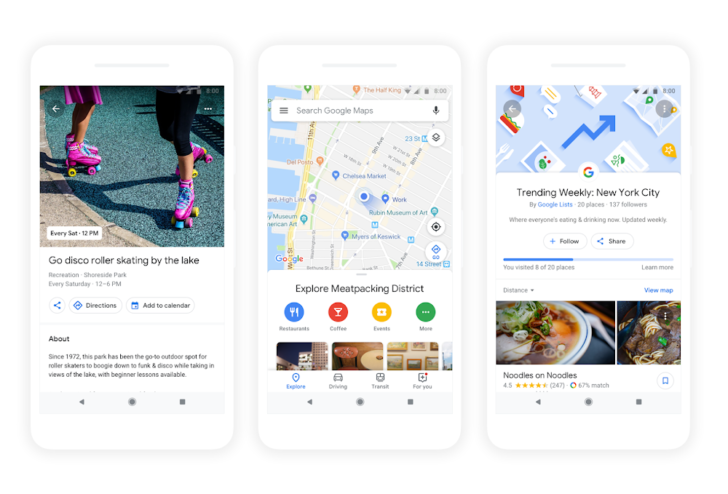

Recommender Systems in Context
========================================================
author: Ilya Kats
date: June 19, 2018
autosize: false

</img>

How Google determines ranking
========================================================

- Relevance
- Distance
- Prominence
  - General popularity
  - Web presence

How to improve ranking
========================================================

- Enter complete data
  - Address in USPO format
  - Phone
  - Meaningul description
- Verify location (phone, emails, postcard, etc.)
- Keep information accurate, especially hours
- Interact with customers, especially by responding to reviews
- SEO best practices apply

Other considerations
========================================================

- Quantity of citations
- Search volume
- Directories and best-of lists
- Wikipedia (?)

Attacks
========================================================

- Fake reviews (https://goo.gl/maps/SfQuq5deRAA2)
- Fake listings (intercepting FBI calls using Google Maps)

New features "For you"
========================================================

</img>

Googler Maps labels (Demo)
========================================================

- https://www.google.com/maps

References
========================================================

<small style="font-size:.7em">
- Google My Business Help. _Improve your local ranking on Google_. https://support.google.com/business/answer/7091?hl=en
- Taylor Kerns. _Google Maps to get more personal with new 'For you'tab, place recommendations_. May 8, 2018. https://www.androidpolice.com/2018/05/08/google-maps-get-personal-new-tab-place-recommendations/
- Barry Schwartz. _How Does Google Maps Decide to Show Labels?_. September 2, 2010. https://www.seroundtable.com/archives/022839.html
- Nitasha Tiku. _How a Hacker Intercepted FBI and Secret Service Calls with Google Maps_. February 27, 2014. http://valleywag.gawker.com/how-a-hacker-intercepted-fbi-and-secret-service-calls-w-1531334747
- Jillian D'Onfro. _These online volunteers fight fake reviews, ghost listings and other scams on Google Maps - and say the problem's getting worse_. April 13, 2018. https://www.cnbc.com/2018/04/13/google-maps-spam-fighters.html
- Google Maps. _Bikini Atoll Reviews_. https://goo.gl/maps/SgDMPUsVdGy
</small>
